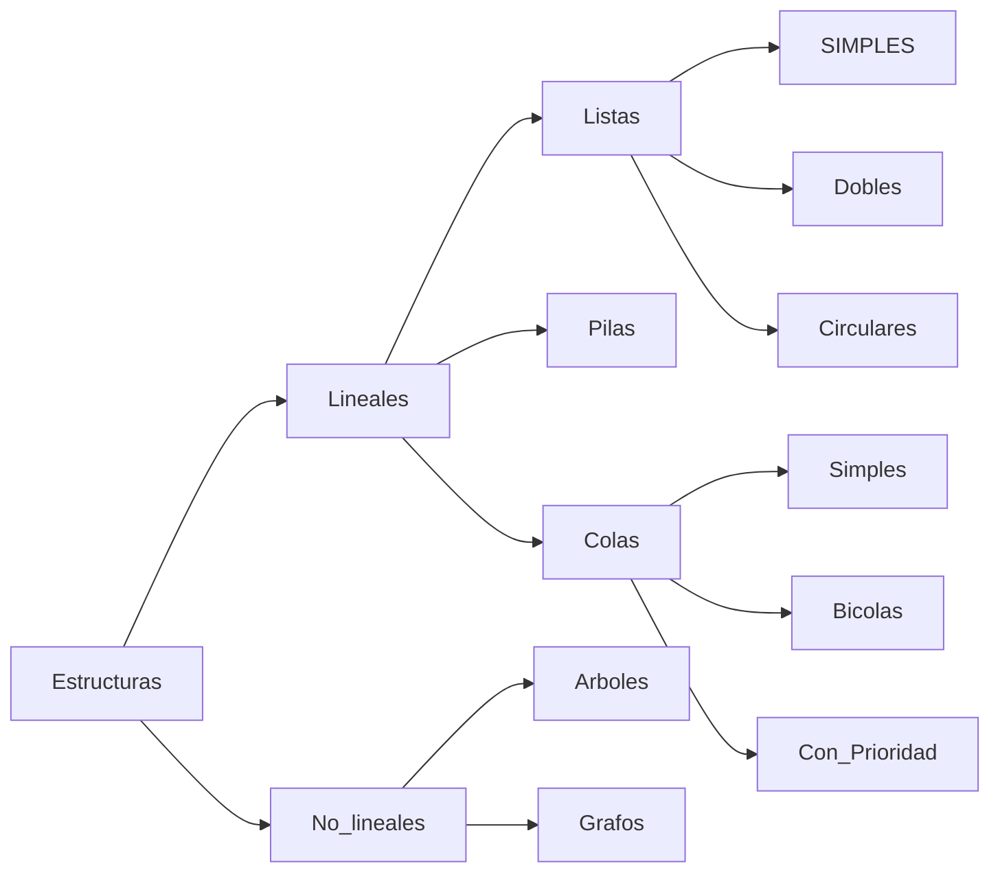

***Objetivo Particular:***
El alumno aplicará las estructuras lineales y no lineales en la implementación de algoritmos.

---

A partir de esta unidad se trabajara 100% de manera dinámica.
Desde esta unidad todas las estructuras establecen **modelos** abstractos, en los que importa la relación de los elementos. 

3.1 - Listas Simples
Es una estructura de Datos con una cantidad variable de elementos que están relacionados uno seguido del otro.

Para manipular una lista es necesario: 
1. Acceder al primer elemento.
2. A partir de él, poder acceder a los demás.
**Ligas**

| INFO| LIGA| ->|INFO  |LIGA |-> | INFO | LIGA | 
|---|---|--|--|--|--|--|--|
Cada cuadro o par de INFO-LIGA se le llama nodo.
Una lista es una secuencia de nodos, cada uno de los cuales tiene al menos dos campos:

| INFO|LIGA |
|---|---|

#### Apuntador

**Sintaxis**
 - Variable = ^ TipodeDatos
 - Crea (Variable Apuntador) --> Proceso de asignación de memoria para almacenar elementos.
 - Quita (Variable Apuntador) --> Proceso de liberar memoria.
Para indicar el contenido de la variable apuntador : variable^

##### 1. Algoritmo.
Algoritmo que crea una lista, agregando cada nodo al **principio**.

 ***Idea grafica:***
 
|Paco|LIGA| -->| Luis| LIGA | -->| Hugo | LIGA | 
|---|---|-|-|-|-|-|-|
|Q/P|||Q/P| | |P/| |
Se comienza con Hugo, se introdujo dentro de la lista como el primer valor dentro de la lista pero deseamos insertar un valor nuevo detrás del primero que en este caso es el de Hugo. P y Q representan apuntadores que apuntan a la dirección de memoria en donde se almacenará el valor especificado, en este caso el valor Hugo esta siendo apuntado por el apuntador, por lo que es natural pensar que el apuntador que comienza todo y debemos recorrer para que continue siendo el primero es el apuntador P. 
Entonces comenzando ya se creo un banco de memoria que es rastreado por el apuntador P (quien tiene la dirección de memoria) y contiene en este el valor Hugo y la liga a la que apunta, es decir, el siguiente banco de memoria que será utilizado.
Como deseamos insertar un banco de memoria nuevo detrás del banco de memoria de Hugo, primero se creará el banco de memoria nuevo con un apuntador nuevo, Q en este caso, una vez creado podemos hacer que el apuntador de nuevo Banco de memoria Q sea igual al banco de memoria de P y la liga que conecta el siguiente banco de memoria con el anterior tomara el valor de Q, así se mantiene la dirección del primer banco de memoria así como escribirlo detrás del anterior reedirigindo este hacia enfrente.

En la idea principal se puede decir que se usa una dirección banco de memoria auxiliar.
