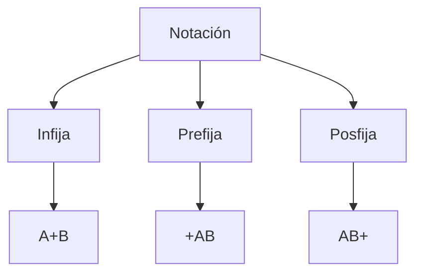

**Como traducir manualmente una expresión infija a otra notación**

Puntos a tener en cuenta:
- Prioridad de los operadores:
	1. Potencias ^
	2. Multiplicación / División \*/
	3. Suma / Resta + - 
- Los operadores con mayor prioridad se evalúan primero. 
- SI hay dos o más operadores con la misma prioridad, se ejecutan de izquierda a derecha. 
- Si la expresión tiene paréntesis, éstos tienen la mayor prioridad.
- Tienen más prioridad de los paréntesis internos a los externos.
- Una expresión traducida JAMÁS tendrá paréntesis.

*Ejemplo:*

1. (A\*B)\^(D-C) +5

Prefijo:
**\*AB ^(D-C) + 5**
**\*AB** ^ **-DC** + 5
**^\*AB-DC** + 5
**+^\* AB -DC 5**

Posfijo:
**AB\*** ^(D-C) + 5
**AB\*** ^ **DC-** + 5
**AB\*DC-^** +5
**AB\*DC-5+**

2. (3\*2+(4\*2))^(3-2)
Prefijo: 
(3\*2  +  **\*4,2**) ^(3-2) 
(**\*3,2**  +  **\*4,2**) ^(3-2)
**+\*3,2,\*4,2** ^(3-2)
**+\*3,2,\*4,2** ^ **-3,2**
**^+\*3,2,\*4,2,-3,2**

Posfijo:

(3\*2 + **4,2\*** )(3-2)
(**3,2\*** + **4,2\***)^(3-2)
**3,2\*,4,2\*,+** ^(3-2)
**3,2\*,4,2\*,+** ^ **3,2-**
**3,2\*,4,2\*,+3,2-^**

