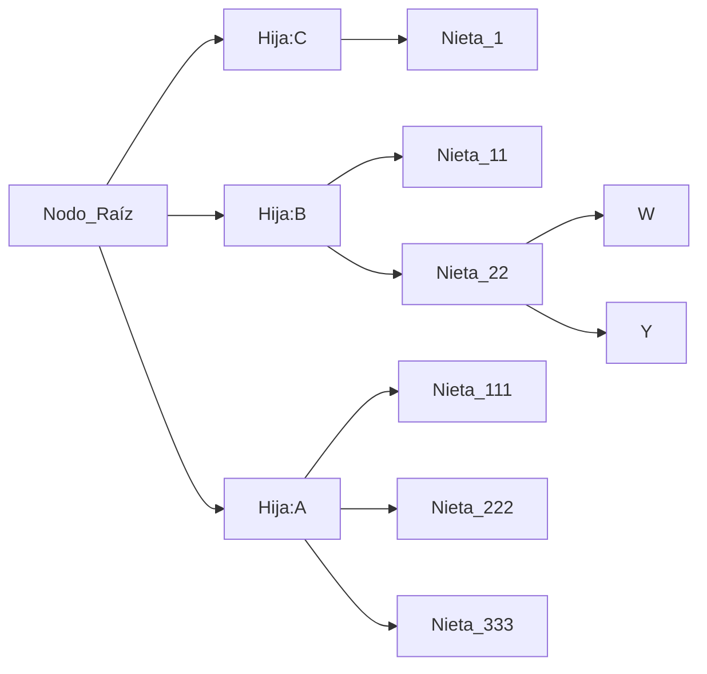
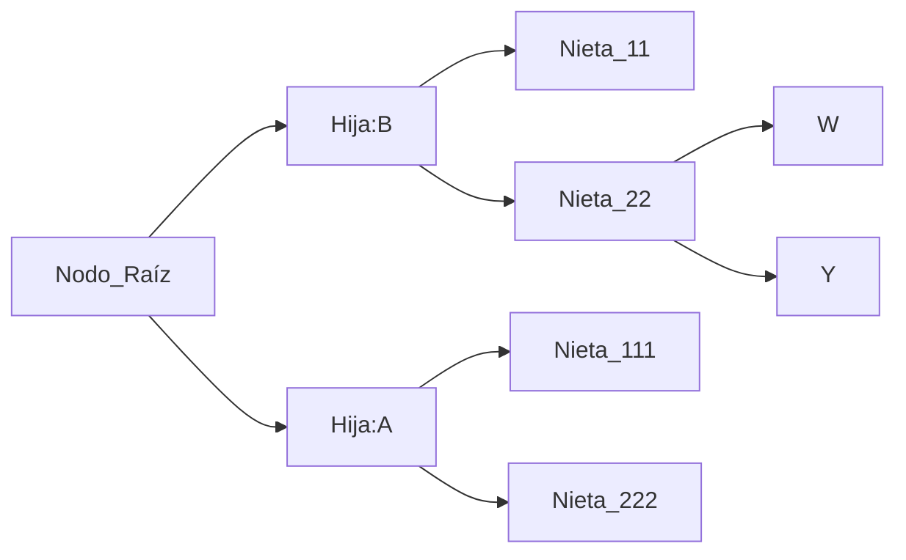
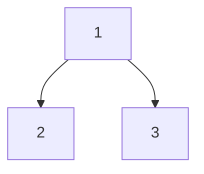
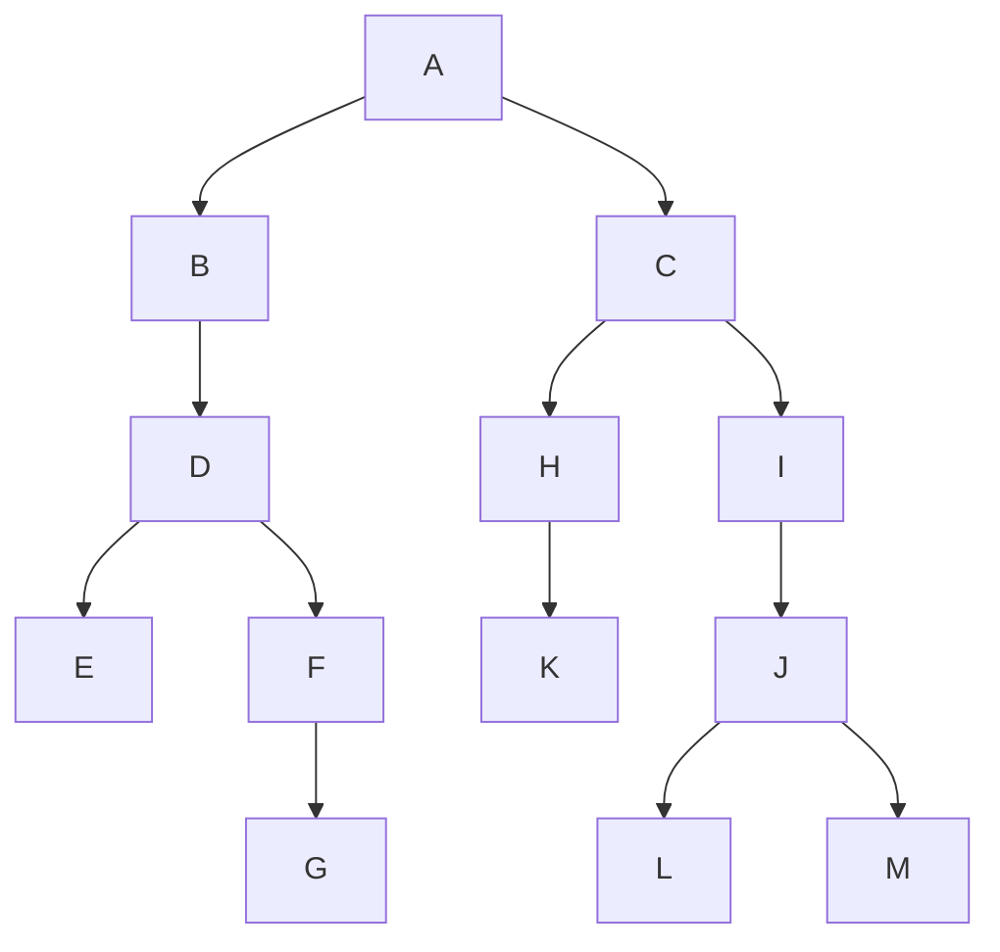
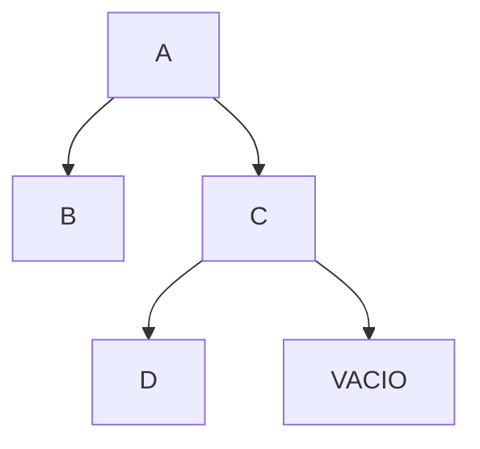

Es una estructura no lineal y dinámica, esto debido a que la estructura de esta puede cambiar durante la ejecución del programa, gracias a los apuntadores.

Nodo principal del que van a surgir los subnodos, este será llamado como **nodo raíz**. 

*Aplicaciones:*
- Manejo de relaciones jerárquicas.
- Análisis de decisiones.
- Representación de fórmulas matemáticas.
- Ordenamiento de información y archivos.
- Simulación de determinados procesos estocasticos.

La manera más sencilla para poder representar un árbol visualmente es a través del uso de grafos.

**Tipos de árboles**:
- Arboles contiguos: Arreglos
- Arboles Ligados: Apuntadores

**Características de árboles:**
- Todo árbol no vacío tiene un **único** nodo raíz.
- No es posible crear ciclos.
- Número de lineas con las que se conectan los nodos siempre será $n-1$. Donde $n$ es el número de nodos.
- Un nodo $X$ es hijo directo de un nodo $Y$ sí $X$ es apuntado por $Y$.
- El grado será el número de descendientes directos que tiene un nodo. El grado del árbol será el grado máximo de todos los nodos del árbol.
- Nivel es el número de arcos que se deberá recorrer para llegar a un nodo determinado **Nodo+1**, por definición la raíz tiene nivel 1. 
- Altura es el máximo número de niveles el árbol.



Para representar este árbol en la memoria deberíamos generar nodos con campos de información y tres que apunten a otro nodo, esto debido al Nodo Raíz y al nodo Hija:A ya que tienen 3 nodos hijos, esto desperdicia mucha memoria y esta es la razón por la que buscaremos transformarlos a árboles binarios.

**Árboles binarios:**
Estructura de datos no lineal en la que cada nodo puede contener **1 o 0 o 2** nodos hijos. El nodo raíz se conectará con dos subárboles llamados *izquierdo* y *derecha*. 


**Transformación de árboles no binarios a Binarios:**
1. Enlazar los hijos de cada nodo en forma horizontal.
2. Enlazar en forma vertical el nodo padre con el hijo que se encuentre más a la izquierda, eliminar el vínculo de ese padre, con el resto de los hijos.
3. Rotar el diagrama resultante 45 grados a la izquierda y así obtendrá el árbol binario correspondiente.

**Recorridos de árboles**
1. *Preorden*: Visitar raíz, recorrer subárbol izquierdo, recorrer subárbol derecho.
2. *Inorden*: Recorrer subárbol izquierdo, visitar raíz, recorrer subárbol derecho.
3. *Posorden*: Recorrer subárbol izquierdo, recorrer subárbol derecho, visitar raíz. 


*Ejemplo de recorridos*:
- _Preorden_: 1, 2, 3 
- *Inorden*: 2, 1, 3 
- *Posorden*: 2, 3, 1
**Ejemplo con árbol más grande**: 


*Preorden*: A, B, D, E, F, G, C, H, K, I, J, L, M 
*Inorden:* B, E, D, G, F, A, C, H, K, C, L, J, M, I, 
*Posorden:* E, G, F, D, B, K, H, L, M, J, I, C, A 

**Algoritmo que realiza el recorrido en PREORDEN**
```
PREORDEN(NODO)
SI (NODO != NULL)
	ESCRIBIR(NODO^.INFO)
	PREORDEN(NODO^.IZQ)
	PREORDEN(NODO^.DER)
FINSI
FINFUNCIÓN
```



1. Preorden(Raíz = A)
2. Se va al nodo izquierdo de A y llama a la función en B **Preorden(B)**
3. En esa rama se escribe el nodo raíz: B
4. Se llama a Preorden en rama izquierda de B, pero como esta vacío no se ejecuta nada. 
5. Se llama PO en rama derecha de B, como es vacía no se ejecuta nada. 
6. Se regresa a la rama raíz A y se manda a llamar a  su nodo derecho C en PO. 
7. Como se encuentra en C, se imprime esta raíz y se manda a llamar a su rama izquierda D
8. Se imprime esta nueva raíz y se manda a llamar PO en rama izquierda, como no existe no hace nada.
9. Se manda a llamar a PO en la rama derecha de D, como no hay, no se ejecuta nada. 
10. Se regresa a la raíz C y manda a llamar a PO en la rama derecha de C, como no existe rama derecha, no se imprime nada. 
11. Ya se acabo de imprimir todo el árbol.

